# University Rankings Analysis

**Team Members**: Faisal Alkulaib, Lama Albeshri, Muhannad Alahmadi, Ghadah Alsulami, Raghad Alerowi

## Introduction (Problem, Objectives)
University rankings play a significant role in influencing decisions made by students, faculty, and policymakers. The objective of this project is to analyze three prominent university ranking datasets (Shanghai, Times Higher Education, and World University Rank) to uncover insights about global academic institutions and their performance across various metrics. The analysis aims to provide a clearer understanding of which factors drive high rankings and how universities compare across regions and categories.

## Dataset Overview and Source
We utilized three datasets for this analysis:
- **Shanghai Ranking**: A dataset containing the rankings, scores, and details of the top universities.
- **Times Higher Education**: University rankings based on various factors including SDG (Sustainable Development Goals) scores.
- **World University Rank**: A dataset ranking universities based on education, employability, research, and faculty quality. This dataset was sourced from Kaggle.

## List of EDA Steps
The following Exploratory Data Analysis (EDA) steps were applied:
1. **Data Cleaning**: Removal of missing or erroneous values, replacement of placeholders with zeros, and converting necessary columns to numeric types.
2. **Outlier Detection**: Identification of outliers through graphical and statistical methods to ensure accurate representation of the data.
3. **Rank Distribution Analysis**: Visualization of the distribution of university ranks across the datasets.
4. **Country-Based Aggregation**: Grouping the data by country to analyze the concentration of top-ranked universities.
5. **Top 10 Universities**: Filtering the top 10 universities in each dataset for comparative analysis.
6. **Saudi Arabian Universities**: Isolating universities from Saudi Arabia to analyze their global and regional performance.
7. **Correlation Analysis**: Exploring correlations between different ranking factors such as education quality, employability, and research scores.
8. **Visualization of Rankings by Region**: Visualizing how different regions perform based on university rankings.
9. **Ranking Changes Over Time**: For datasets with historical data, identifying trends and shifts in rankings over time.
10. **Sustainability Focus**: Analyzing SDG-related scores in the Times Higher Education dataset to understand the emphasis on sustainability.

## Final Insights and Charts
1. **Top 10 Global Universities**: Harvard, MIT, and Stanford consistently rank among the top globally, with minor variations across datasets.
   - *Chart*: Bar graph of the top 10 universities in each dataset.
   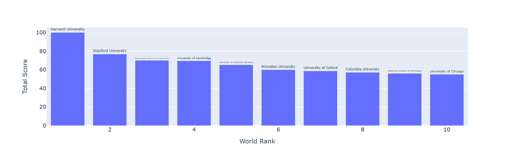
   
   
2. **Country Dominance**: The United States leads with the highest number of top-ranked universities, followed by the United Kingdom and China.
   - *Chart*: Bar plot showing the number of top 100 universities by country.
   
3. **Saudi Arabia's Performance**: Saudi universities are ranked primarily in the 300-500 range globally, showing room for improvement in international metrics.
   - *Chart*: Table of Saudi universities and their ranks.
   
4. **Education vs Employability**: Universities excelling in education do not always rank equally high in employability, indicating a potential mismatch between academic and professional preparation.
   - *Chart*: Scatter plot comparing education and employability ranks.

5. **Faculty and Research Excellence**: Universities with strong faculty tend to have better research output, which correlates positively with their overall rank.
   - *Chart*: Correlation matrix between research, faculty, and overall scores.
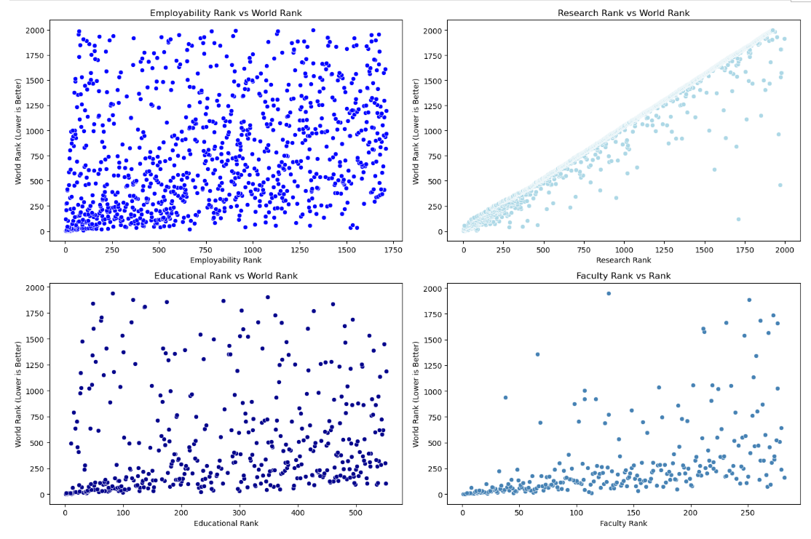
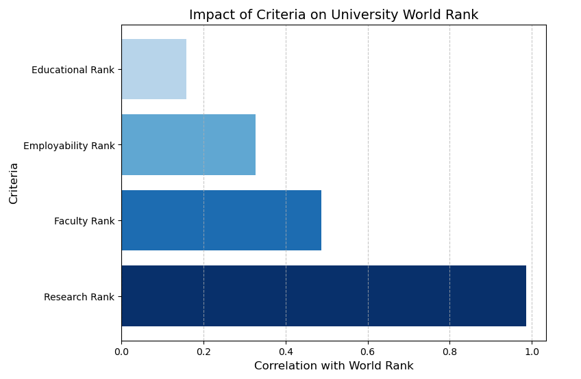

6. **Outliers in the Rankings**: A few universities rank unexpectedly higher or lower due to outliers in specific categories such as research funding or international collaboration.
   - *Chart*: Boxplot identifying outliers.
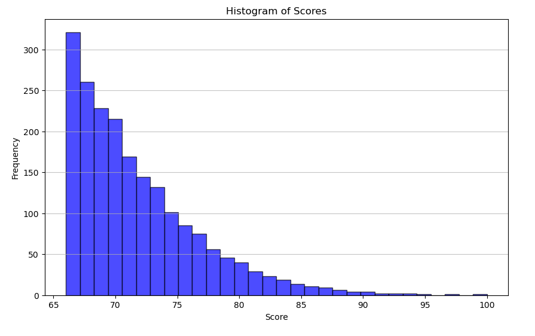 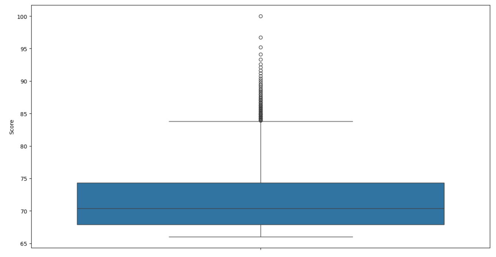 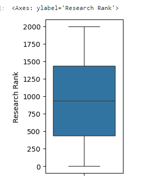

7. **More Insightful Charts**
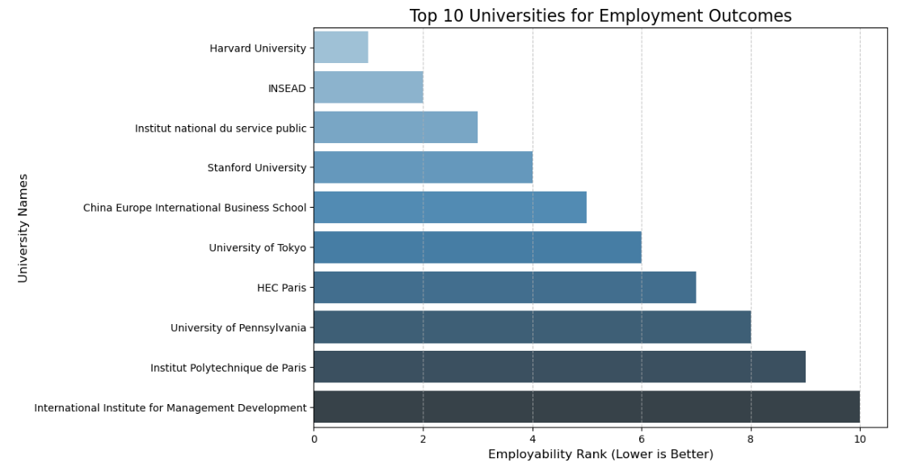
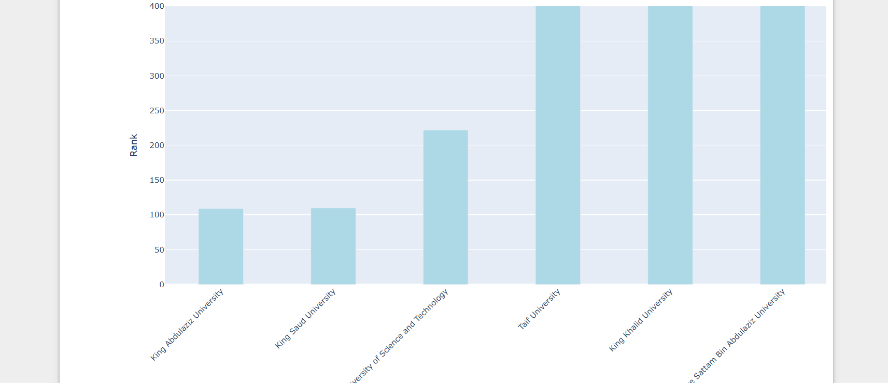  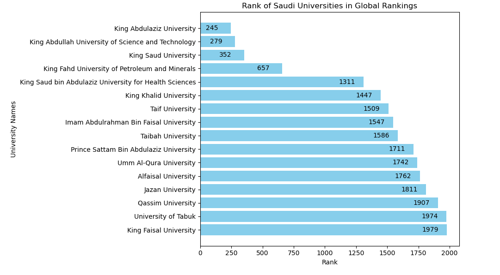
 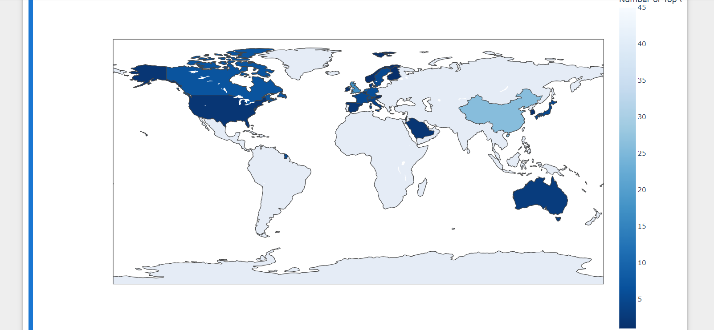
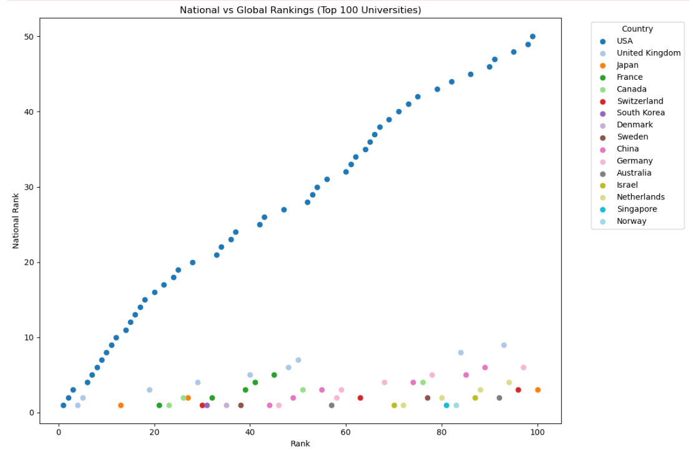  